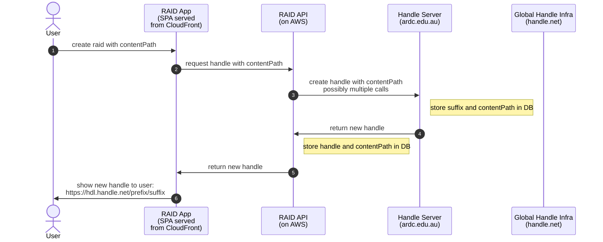
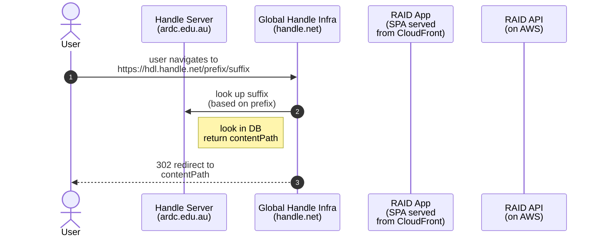

RAID to ARDC handle server

Registering a handle infrastructure:
Handle server registers with "Global Handle Infrastructure" manually.

* handle server is assigned a prefix by global infra
* global infra stores a mapping between the prefix and the handler
server's API where it can lookup the contentPath for a suffix 

Minting a handle:

Resolving a handle:
